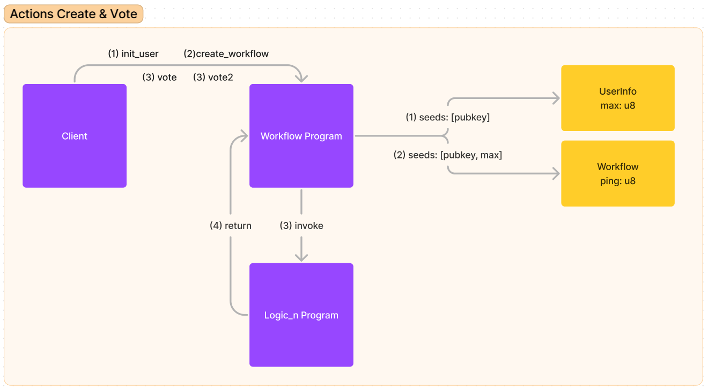
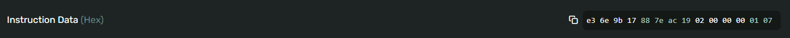

# What we build ?

You can find code demo here:

- Main program: https://github.com/hectagon-finance/pos_solana/tree/done-invoke-to-logic1/workflow
- Invoked program: https://github.com/hectagon-finance/pos_solana/tree/done-invoke-to-logic1/logic1
- Invoked program2: https://github.com/hectagon-finance/pos_solana/tree/done-invoke-to-logic1/logic2

## Our design:



- (1) when client interact with init_user( ) function, it will create an PDA (seeds is [programID, Pubkey]) with max = 0

  `max: Number of workflows initiated.`

- (2) when client interact with create_workflow( ) function, it will create an PDA (seeds is [programID, Pubkey, max]) with ping = 0 and max++ (max increase 1)

  `ping: Number of votes in a workflow.`

_NOTE:_ before run (1) and (2) You need to edit key pair in 2 place:

````
1. in test/workflow.ts
const keypair =  web3.Keypair.fromSecretKey(
    Uint8Array.from([64,33,98,76,216,30,65,85,81,32,240,30,164,197,23,225,253,179,10,197,190,174,155,56,130,224,202,128,189,201,48,37,20,123,160,201,77,149,50,29,89,209,232,173,89,87,250,249,192,221,235,132,195,237,147,165,80,165,155,92,70,100,203,86])
  )
2. in terminal run ```solana config get```
   you will see: Keypair Path: /home/trung1701/.config/solana/id.json
   please replace keypair in id.json
````

- (3) when client interact with vote( ) function, Workflow program will invoke to Logic1 program. Logic1 program is a program built on anchor. ping++ (ping increase 1) in this workflow

- (4) when client interact with vote2( ) function, Workflow program will invoke to Logic2 program. Logic2 program is a program built on native rust. ping++ (ping increase 1) in this workflow

Logic1 program and Logic2 program are built completely separate from workflow program.
Workflow program does not have `IDL` files of Logic1 program and Logic2 program. So we only know the programID has been deployed to the solana network to interact with the program.

In Solana programming, an Interface Definition Language (IDL) specifies a program's public interface. It defines a Solana program's account structures, instructions, and error codes. IDLs are .json files used to generate client-side code, allowing users to easily interact with a Solana program.

So what is the difference between CPI with anchor and Native Rust, and what should be noted when transmitting data when performing CPI.

## CPI with anchor (Logic1 program)

You probably all know the discriminator in the anchor. Actually what is it ?

The discriminator is actually used to determine which function should be called in an anchor program
The discriminator is defined by the first 8 bytes of the Sha256 hash of `"global:<NameOfFunction>"`

For example, in logic1 program there is a `vote( )` function. How to make workflow program invoke to logic1 program without errors ? To do this, inside the data field of the instruction, we will have to initialize a vector where the first 8 bytes are to initialize the discriminator.

```
    Step 1: using sha256 for string "global:vote" and you will get the result:
    e36e9b17887eac197678a3a9928f2dfc8a1d553a698244524539ebb858a2b4d0

    Step 2: Take the first 16 letters and convert to 8 bytes array
    e36e9b17887eac19 => [227, 110, 155, 23, 136, 126, 172, 25]
```

Nice! However, that's just the discriminator, you need to pay more attention depending on the format you want to send from the client. In my example the client wants to post a `struct{number1:1, number2:7}`. Then we converted it to a bytes array. this byte array has length 2. You can find this code in the test folder of the workflow program, in the `workflow.ts` file, look at the comment `//test invoke from anchor program to anchor program(logic1)`. In order for the vote function in the anchor program to recognize this data, you will need 4 bytes to contain the length information of this byte array, then comes the information of the bytes array containing the struct you want to send. You can learn more about other data formats here: `https://book.anchor-lang.com/anchor_references/space.html`

So when performing CPI we can see that the instruction data we sent on solana explorer has the following format:



As you have seen to perform an invoke to any anchor program we will have to follow the anchor data structure rules. Otherwise we will immediately receive an error.

## CPI with native rust (Logic2 program)

For native rust we can do invoke from another program normally without too much difficulty. it's totally depends on you. So I'm not going to show anything, I'm simply giving a demo with the logic2 program so you can see and compare.
